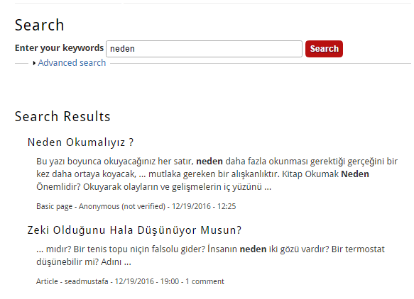

# <p align="center" >Yayinevinin Yayınları Sitesi ( Drupal ) </p> 
[](https://travis-ci.org/joemccann/dillinger)  [](https://opensource.org/licenses/MIT) 

# İçindekiler Tablosu

1. [Giriş](#giris)
      * 1.1 [Hosting](#hosting)
      * 1.2 [Drupal 7](#drupal)  
      * 1.3 [FTP](#ftp)	 
2. [Proje](#proje) 
   * 2.1 [Sosyal medya link verme](#sosyalmedya)	 
        - 2.1.1 [Shareaholic Eklentisi](#shareaholic) 
        - 2.1.2 [‘SocialMediaLinks’ Eklentisi](#socialMediaLinks)  
        - 2.1.3 [“Views RSS” Eklentisi](#viewsRSS) 
   * 2.2 [Post’lar ve Sayfa’lar içerisinde resim, video ve ses gibi multimedya dosyaları bulundurma](#postmultimedya)  
   * 2.3 [Post’lara/Sayfalara yorumlar yapma ve Yönetici onayı](#yorum) 
   * 2.4 [Temanın siteye uyarlanması ve Tema içeriğinin düzenlenmesi](#tema) 	 
   * 2.5 [Site içerisinde  içerik arama işlemleri](#icerikarama) 
3. [Kategoriler](#kategoriler) 	 
    * 3.1 [First Sidebar](#firstsidebar) 	 
    * 3.2 [First Bottom – Second Bottom](#firstbottom) 	 
4. [Menü sayfaları](#menusayfalari)  
    * 4.1 [Anasayfa](#anasayfa)	 
    * 4.2 [Neden Okumalıyız ?](#nedenokumaliyiz)	 
    * 4.3 [Yayına Hazırlananlar](#yayinahazirlananlar)	 
    * 4.4 [İletişim](#iletisim)	 
    * 4.5 [Bize Ulaşın](#bizeulasin) 
    * 4.6 [Forum](#forum)	 
5. [Kaynakça](#kaynakca) 	 


## 1.  Giriş 

**“dev-dostkitabevi.pantheonsite.io”** adlı yayınevi tanıtım amaçlı site için iş analizi yapıldı.
Hangi içerik yönetim sistemiyle, hosting alanı kullanılacağı belirlendi.
**Pantheonsite.io**’dan alan hosting alındı.
Sitenin içeriğini düzenlemek için **Drupal 7** içerik yönetim sistemi kullanıldı.
Proje için e-posta alındı. Web sitesinin motor bölümü tasarlandı ve kodlandı.Kulanıcı arayüzünde ve admin panelinde kullanılmak üzere çeşitli eklentiler kuruldu ve eklentiler geliştirildi. Sitede kullanılmak üzere içerik türleri eklendi.
Arama motorlarında sitenin görülmesi için anahtar kelimeler eklendi.

### 1.1 Hosting
Pantheonsite.io’dan ücretsiz hosting alanı alındı. 

### 1.2 Drupal 7
“dev-dostkitabevi.pantheonsite.io” yayınevi sitesi için Drupal içerik yönetim sistemi kullanıldı.  Business Theme ön tanımlı tema olarak ayarlandı.


### 1.3 FTP

FTP Sunucuya erişmek için 
```sh
Host: dbserver.dev.9f328850-5f5c-42b7-876f-cc3cd71.drush.in
Username: pantheon
Port:2222
``` 
Bilgileri kullanıldı.


## 2. Proje

### 2.1 Sosyal medya link verme
#### 2.1.1 Shareaholic Eklentisi
“Shareaholic” eklentisi ile Site içerisinde yayınlanan Post’ların, Sosyal Medya hesaplarından (facebook, twitter) ve RSS üzerinden yayılması/paylaşılabilmesi için gerekli düzenlemeleri yapıldı. 


#### 2.1.2 ‘SocialMediaLinks’ Eklentisi

‘SocialMediaLinks’ eklentisi ile siteyi sosyal platformlarda paylaşmak için gerekli linkler verildi.İçerik blok bölgesi olarak First Sidebar bölümüne eklendi. 


#### 2.1.3 Views RSS” Eklentisi

İçerik dağıtımı için Views RSS eklentisi kullanıldı.  First Sidebarda İçerik Dağıtımı adındaki blok bölgesinde yayınlandı.


### 2.2 Post’lar ve Sayfa’lar içerisinde resim, video ve ses gibi multimedya dosyaları bulundurma

Ön tanımlı durumu, ön sayfa tanıtım, yorum ayarları, vb dahil olmak üzere içerik türlerini yönetmek için Yapı bölümünden resim,video,ses, multimedya dosyalarını içerecek şekilde içerik türü oluşturuldu. 
Bu içerik türünden içerik eklenip sitede yayınlandı.


### 2.3 Post’lara/Sayfalara yorumlar yapma ve Yönetici onayı

Kullanıcılar siteye üye oldukları takdirde postlara veya sayfalara yorum yapma haklarına sahip olmaktadırlar.Yapılan yorum admin onayı ile sitede yayınlanmaktadır.

### 2.4 Temanın siteye uyarlanması ve Tema içeriğinin düzenlenmesi 

“dev-dostkitabevi.pantheonsite.io” yayınevi  sitesi için Business Theme ön tanımlı tema olarak ayarlandı. Sitenin slide-image-1/2/3 resimleri ftp aracılığıyla değiştirildi. 


### 2.5 Site içerisinde  içerik arama işlemleri 
Kullanıcı site içerisinde  içerisinde içerik veya kullanıcı arayabilir. Advanced search seçenekleri ile belli bir kategori içerisinde arama yapılabilmektedir.




## 3. Kategoriler

### 3.1 First Sidebar
 
 
<table>
   
    Blok yerleşiminde sidebar bölümüne bu içerikler listelenmiştir.
   
  <tr> 
    <td></td>
    <td></td>
    <td></td>
  </tr>
 </table>


### 3.2 First Bottom – Second Bottom 


## 4. Menü sayfaları 

Anasayfa, Neden Okumalıyız ? , Yayına Hazırlananlar, Hakkımızda,  iletişim, Forum,Bize Ulaşın  sayfaları oluşturuldu, link verildi ve içerik eklendi.
### 4.1 Anasayfa


### 4.2 Neden Okumalıyız ? 


### 4.3 Yayına Hazılananlar  


### 4.4 İletişim
 
<table>
<tr> 
    <td></td>
    <td></td>
    <td></td>
  </tr>
 </table>


### 4.5 Bize Ulaşın
 


### 4.6 Forum


## 5. Kaynakça

 * https://www.drupal.org/
 * https://www.drupal.org/training
 * https://www.drupal.org/project/business
 * http://www.magnec.com/
 * https://www.youtube.com/watch?v=OJa9RrWl2f8&list=PLnILv9Xg6-ztR6H2t-OApNokDC1ozuyRE 
 
 # Licence 
 Copyright © 2020 [Sead Mustafa](https://github.com/seadmustafa).<br />
This project is [MIT](https://github.com/kefranabg/readme-md-generator/blob/master/LICENSE) licensed.
 
